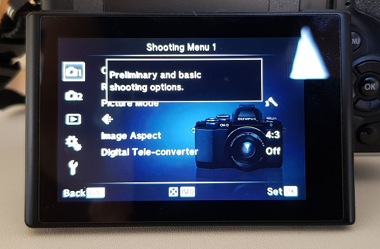
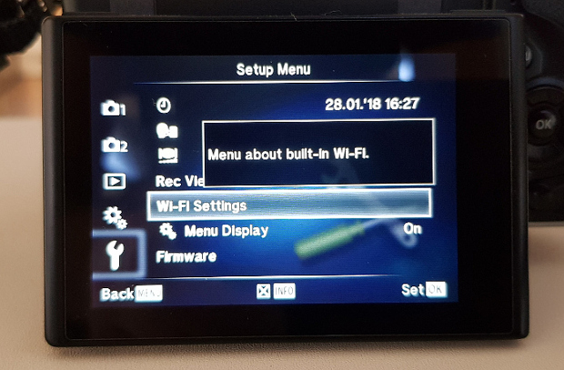
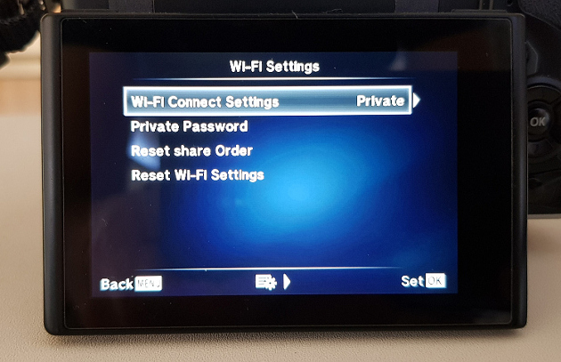
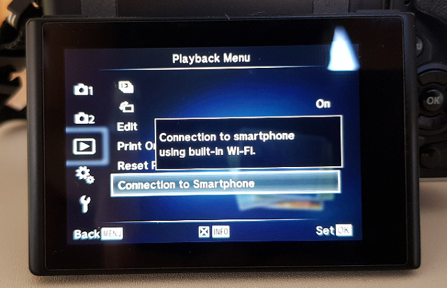
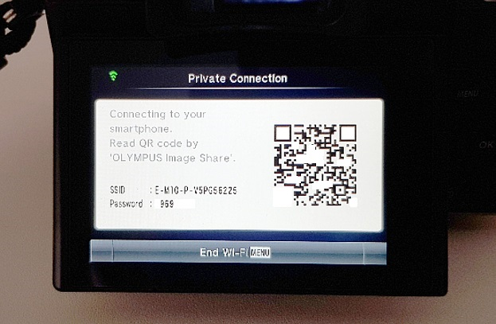
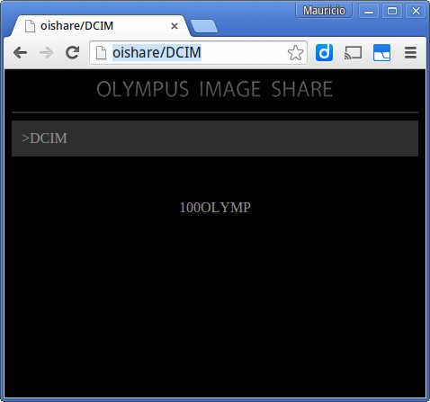
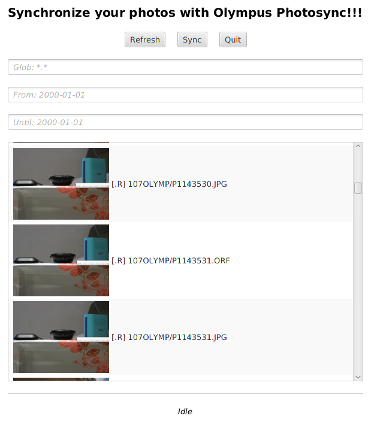

# 1. Overview

[](/LICENSE.md)

This application allows to wirelessly download media from Olympus cameras to your PC.

**More than 4000 downloads** ([gh](https://github.com/mauriciojost/olympus-photosync/releases/)/[bb](https://bitbucket.org/mauriciojost/olympus-photosync/downloads/))!!!

It has been successfully tested on the following cameras:

- _Olympus TG-860_ (thanks Lee!)
- _Olympus TG-4_ (thanks Alain!)
- _Olympus TG-5_ (thanks Jim!)
- _Olympus TG-6_ (thanks Ivan!)
- _Olympus OMD E-M1_ (thanks Jean Pierre!)
- _Olympus OMD E-M5 Mark II_ (thanks David!)
- _Olympus PEN Lite E-PL7_ (thanks Dmitri!)
- _Olympus OMD E-M10_ (thanks Mauricio!)
- _Olympus OMD E-M10 MK3_ (thanks Alex!)

Also it should work _out-of-the-box_ with other similar Olympus cameras.

This application has been successfully tested on the following operating systems:

- _Linux_ (thanks Mauricio!)
- _Windows_ (thanks Mauricio!)
- _Mac OS_ (thanks Ola!)

[Contact me via _mauriciojostx@gmail.com_](mailto:mauriciojostx@gmail.com) if you have any issues.

# 2. Get started

## 2.a. Download and install the application

You need to install `Java 1.8.40` or higher as a first step (until Java 10 included, higher versions of Java are not yet supported).

The remaining installation procedure depends on your operating system. See below all releases:

[](https://github.com/mauriciojost/olympus-photosync/releases/)

Latest release is: [v1master](https://github.com/mauriciojost/olympus-photosync/releases/tag/v1master)

### Install on Windows

One Java is installed, download the latest release for Windows:

[](https://github.com/mauriciojost/olympus-photosync/releases/download/v1master/olympus-photosync-1master.zip)

No installation needed. Decompress the release in `C:\olympus\` (you will need to create the directory).

The executables will be under the unzipped directory, in the `bin` subdirectory: you will use `olympus-photosync.bat`.

### Install on Linux via native packages

For Linux both _.deb_ and _.rpm_ packages are provided. With Java installed, download the latest release for your own distribution:

[](https://github.com/mauriciojost/olympus-photosync/releases/download/v1master/olympus-photosync_1master_all.deb)
[](https://github.com/mauriciojost/olympus-photosync/releases/download/v1master/olympus-photosync-1master-1.noarch.rpm)

You can install such packages using _dpkg_ and _rpm_ tools.

For instance, the _.deb_ package can be installed in _Ubuntu_ typing:

```
sudo apt-get install openjdk-8-jre
sudo dpkg -i photosync_x.x_all.deb
```

The tool `olympus-photosync` will be added to the `PATH` so that you can use it anywhere.

### Install on MacOS / Linux as standalone

With Java installed, download the latest release:

[](https://github.com/mauriciojost/olympus-photosync/releases/download/v1master/olympus-photosync-1master.tgz)
[](https://github.com/mauriciojost/olympus-photosync/releases/download/v1master/olympus-photosync-1master.tgz)

These packages are provided so that the application can be used without
installation. Download the release and decompress it somewhere
(for example in _/home/user/opt/olympus_). Then the executables will be
under the unzipped directory, under the _bin_ subdirectory.

The tool `bin/olympus-photosync` is the one to be used.

You may need to execute the following command to make the binary executable:

```
cd <uncompression-directory>
chmod +x bin/olympus-photosync
```

## 2.b. Run the application

To transfer media from your camera to your PC follow these steps:

1. Switch on your camera and go to the _Setup Menu_.

    

2. Set up the WIFI service of your camera as _Private_.

    This step needs to be done only once as your camera
    will remember this setting.

    Go to the WIFI Settings:

    

    And select _Private_ mode:

    

    This step is **very important**. If not set up correctly the camera won't let
    this application download media files.

3. Launch the WIFI service from your camera.

    

    You should see something like this:

    

4. Connect your PC to the WIFI provided by the camera.

    In the example above, the WIFI network (SSID) was `E-M10-P-V5PG56225`. You
    will need to find your own camera SSID.

    Then you need to connect to that WIFI network from your PC.

    Once done, you can verify that the connection is correct opening any of the two
    following URLs: <a href="http://192.168.0.10/" target="_blank">link1</a> or
    <a href="http://oishare/" target="_blank">link2</a> .

    If any of them show black screen as the one below, then you're correctly connected.

    

    You can close that browser and continue with the steps below.

5. Now you are ready to execute the application.

    Execute the application. This step depends on the Operating System (Windows, Linux, etc.)
    you have.

    - If Windows: go to `C:\olympus\<uncompression-folder>`, then to `bin` subfolder, and double click `olympus-photosync.bat`
    - If Linux standalone or MacOS: go to `/home/user/opt/olympus`, then to `bin` subfolder, and execute `./olympus-photosync`
    - If Debian or Red Hat: simply execute `olympus-photosync`

    The application will start copying files from your camera to a local
    directory (as configured).

    By default, the application synchronizes media one way (remote to local).
    If remote files are already copied locally the application will skip them.
    This means it is safe to run it multiple times to finish synchronization in case of
    network connectivity issues.

    More customized behaviours can be achieved via configuration.
    For such, see sections below.

## 2.c. Configure

The application should work _out-of-the-box_ for the cameras listed above. However
you may want to customize its execution, for instance to download photos to
a non-default directory.

For such cases, the application uses several parameters that can be set either
through command line arguments, or by modifying the configuration file.

Command line arguments take precedence over the configuration file.

### Via command line arguments

There are several parameters to be set. To list these parameters you can execute:

```
# In Linux
olympus-photosync --help
```

For instance, to synchronize files and download them to local directory `/home/john/output` do:

```
# In Linux
olympus-photosync --output-directory /home/john/output

# On Windows
olympus-photosync --output-directory C:\output
```

To synchronize files of SEP2017 do:

```
olympus-photosync --from 01-09-2017 --until 30-09-2017
```

To synchronize only `AVI` or `ORF` files:

```
olympus-photosync --file-patterns *.AVI,*.ORF
```

You can launch the GUI for Linux/MacOS (as in Windows GUI is launched automatically):

```
olympus-photosync --gui
```

In Windows such command line arguments can be passed by modifying the
file `bin\photosync.bat`:

```
set _APP_ARGS=
```

For instance if you want to synchronize only *.AVI you can do:

```
set _APP_ARGS=--file-patterns *.AVI
```

### Persist configuration (via config file)

If you want your configuration to keep being the same along multiple executions of
the application, you can store it in a configuration file and reuse it.

You can generate a template configuration file using:

```
olympus-photosync --init-config
```

Then you can customize as you wish.
After that you can launch the application using such configuration file (and
its settings). See the output of the command above for more information.

## 2.d. Use the Graphical User Interface

This is a relatively recent feature, so be cool! I am very open to feedback.



In Linux/MacOS launch with:

```
olympus-photosync --gui
```

In Windows the GUI is launched automatically.

Feel free to give your [opinion](mailto:mauriciojostx@gmail.com) or
create [issues here](https://github.com/mauriciojost/olympus-photosync/issues)!


# 3. Develop

The main repository is in [GitHub](https://github.com/mauriciojost/olympus-photosync). A secondary repository is in [BitBucket](https://bitbucket.org/mauriciojost/olympus-photosync).

This application is written in _Scala_ and uses _SBT_.

There are two branches that are important to know: 

- branch `master` (latest release) with the following status:

[](https://circleci.com/gh/mauriciojost/olympus-photosync/tree/master)
[](https://coveralls.io/github/mauriciojost/olympus-photosync?branch=master)

- branch `dev` (latest development) with the following status:

[](https://circleci.com/gh/mauriciojost/olympus-photosync/tree/dev)
[](https://coveralls.io/github/mauriciojost/olympus-photosync?branch=dev)

## 3.a. Get started

If you aim to contribute fork the `dev` branch, clone your fork, and create a dedicated branch. 

Find below some useful commands for basic actions.

```
sbt compile  # To compile the application
sbt test     # To test it
sbt run      # To launch it
```

If building with `openjdk`, you will need to install the Linux
package `openjfx`. Also `xvfb` tool needs to be started prior to tests
so that the GUI tests can launch even without display (if running from a display-less
CI server like Jenkins).

You can also use the provided docker image to use `Jenkinsfile`.

## 3.b. Build releases

The project uses _sbt-native-packager_ so you can build packages for
many operating systems / distributions.

```
sbt universal:packageBin         # To build the multi-platform .zip package
sbt universal:packageZipTarball  # To build the multi-platform tarball
sbt debian:packageBin            # To build a Debian package (.deb)
sbt rpm:packageBin               # To build an RPM package (.rpm) (must have rpm tool installed if in Debian OS)
sbt windows:packageBin           # To build a Windows installer (from Windows)
sbt docker:publishLocal          # To build a docker image
```

You cal also build your own docker image to launch the project in
different architectures, such as ARM.
See [here](extras/docker/run/README.md) for more details.

## 3.c. Contribute

This project is _open source_ so you can help make it better!

- **Found issues?** Then please [**file an issue** here](https://github.com/mauriciojost/olympus-photosync/issues)
or send me by mail the logs.
- **Own an OMD E-MX camera not supported?** Then please contact me by e-mail too.
- **Want to code-contribute?** You can create a _PR_ versus [dev](https://github.com/mauriciojost/olympus-photosync/tree/dev) branch in the [**main repository at GitHub**](https://github.com/mauriciojost/olympus-photosync). Keep in mind that there is a [**mirror repository at BitBucket**](https://bitbucket.org/mauriciojost/olympus-photosync) that will be probably marked as _deprecated_ in the future.
- **Need more information?** Send me an [e-mail to _mauriciojostx@gmail.com_](mailto:mauriciojostx@gmail.com).
- **Liked the project?** Then please [give it a star on Github](https://github.com/mauriciojost/olympus-photosync)!
- **Want it to be maintained?** Then please [give it a star on Github](https://github.com/mauriciojost/olympus-photosync)!


# 4. Citations

This project was mentioned in different sites:

- [Medium - Blog Post](https://medium.com/@dmpop/olympus-photosync-wireless-bridge-between-olympus-cameras-and-linux-79b43338e18e)
- [Linux Photography Book - Dmitri Popov](https://gumroad.com/l/linux-photography)
- [Pixls - Thread](https://discuss.pixls.us/t/nifty-tool-for-olympus-cameras/6223)
- [DP Review - Thread](https://www.dpreview.com/forums/thread/4209650)
- [Scribbles And Snaps - Blog Post](https://scribblesandsnaps.com/2018/01/11/olympus-photosync-wireless-bridge-between-olympus-cameras-and-linux/)


